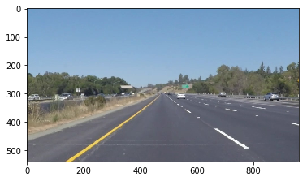
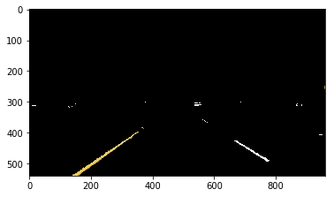
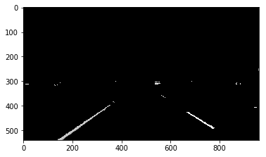
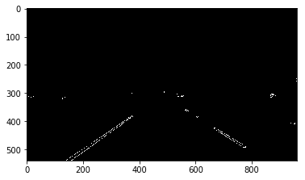
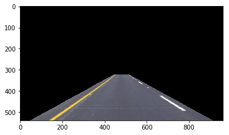
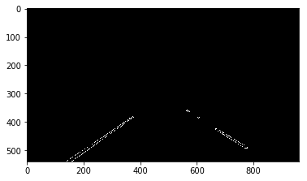
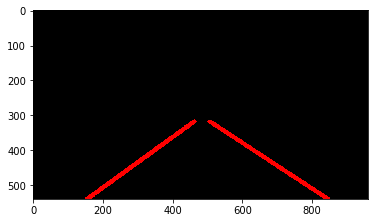
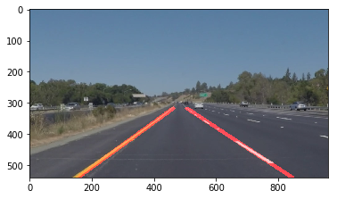

# **Finding Lane Lines on the Road**


My solution to the Udacity Self-Driving Car Nanodegree Lane Lines project.

It provides a pipeline that finds lane markings on the road in images and videos.


---


One of the input images looks like this:



#### 1. Selecting the yellow and white region

We want to boost the yellow and white region to make it easier to  extract the lane markings.

Instead of the colormap RGB, the HSL and HSV colormap are better adapted to do this.
https://en.wikipedia.org/wiki/HSL_and_HSV


Image Source: https://commons.wikimedia.org/wiki/File:Hsl-hsv_models.svg

Here, we use HSV to select the yellow and white regions by using a lower and upper threshold

```python
def select_white_yellow(image):
    hsv_img = cv2.cvtColor(image, cv2.COLOR_RGB2HSV)

    # define range of color in HSV
    lower_yellow = np.array([17,120,100])
    upper_yellow = np.array([32,255,255])
    lower_white = np.array([0,0,237])
    upper_white = np.array([255,255,255])

    # Threshold the HSV image to obtain only yellow/white
    yellow_mask = cv2.inRange(hsv_img, lower_yellow, upper_yellow)
    white_mask = cv2.inRange(hsv_img, lower_white, upper_white)
    # Bitwise-or mask combining yellow_mask and white_mask
    full_mask = cv2.bitwise_or(yellow_mask, white_mask)
    # Bitwise-and mask on the image
    white_yellow = cv2.bitwise_and(image, image, mask = full_mask)
    return white_yellow
```



#### 2. Converting to grayscale
To eventually applied Canny edge detection we convert the image to grayscale.
```python
gray = cv2.cvtColor(white_yellow,cv2.COLOR_RGB2GRAY)
```



#### 3. Smoothing using Gaussian blur
Moreover we smooth the image to get better results.
```python
def smoothing(image):
    kernel_size = 7  #kernel_size should be positive & odd
    blur = cv2.GaussianBlur(image,(kernel_size, kernel_size),0)
    return blur
```


#### 4. Detecting edges using cv2.Canny
We use cv2.Canny with low and high threshold to detect edges in the smoothed grayscale image.
```python
def detect_edges(image):
    # Define our parameters for Canny and apply
    low_threshold = 65
    high_threshold = 150
    edges = cv2.Canny(image, low_threshold, high_threshold)
    return edges
```



#### 5. Selecting the region where the lane marking are expected
We select the region from the image where the lane markings are expected by providing the four vertices in fractions of the size of the image.

Applying the function select_region to the original_image gives



```python
def select_region(image):
    x_size = image.shape[1]
    y_size = image.shape[0]
    # Next we'll create a masked edges image using cv2.fillPoly()
    mask = np.zeros_like(image)

    #defining a 3 channel or 1 channel color to fill the mask with depending on the input image
    if len(image.shape) > 2:
        channel_count = image.shape[2]  # i.e. 3 or 4 depending on your image
        ignore_mask_color = (255,) * channel_count
    else:
        ignore_mask_color = 255  

    # This time we are defining a four sided polygon to mask
    vertices = np.array([[(.05*x_size,y_size),(.46*x_size,.6*y_size), (.54*x_size,.6*y_size), (.95*x_size,y_size)]], dtype=np.int32)

    cv2.fillPoly(mask, vertices, ignore_mask_color)
    masked_edges = cv2.bitwise_and(image, mask)
    return masked_edges

```



#### 6. Obtaining  line segments and connecting them

We obtain line segments using the Hough transform.


```python
def hough_lines(img):

    """

    `img` should be the output of a Canny transform.

    Returns an image with hough lines drawn.
    """
        # Define the Hough transform parameters
    rho = 4 # distance resolution in pixels of the Hough grid
    theta = np.pi/180 # angular resolution in radians of the Hough grid
    threshold = 60     # minimum number of votes (intersections in Hough grid cell)
    min_line_length = 50 #minimum number of pixels making up a line
    max_line_gap = 90    # maximum gap in pixels between connectable line segments

    lines = cv2.HoughLinesP(img, rho, theta, threshold, np.array([]), minLineLength=min_line_length, maxLineGap=max_line_gap)
    line_img = np.zeros((img.shape[0], img.shape[1], 3), dtype=np.uint8)
    draw_lines(line_img, lines)
    return line_img

```


In the function draw_lines, we group them in left and right line segments depending on the sign of their slope. Since the origin of the image coordinate system is in the left upper corner, line segments from the left lane have negative slope and line segments from the left lane have positive slope.

Then we average the slopes and intercepts from line segments on the right and do the same on the left. When averaging we give more weight to line segments closer to the bottom of the images.


```python
def draw_lines(img, lines, color=[255, 0, 0], thickness=12):

    left_y = []
    left_slope = []
    left_intercept = []
    right_y = []
    right_slope = []
    right_intercept = []
    threshold = .3
    x_size = img.shape[1]
    y_size = img.shape[0]

    for line in lines:
        for x1,y1,x2,y2 in line:
            slope = ((y2-y1)/(x2-x1))
            intercept = y1 - x1 * slope
            if slope< -threshold:
                left_slope.append(slope)
                left_intercept.append(intercept)
                left_y.append(max(y1,y2))
            elif slope>threshold:
                right_slope.append(slope)
                right_intercept.append(intercept)
                right_y.append(max(y1,y2))

    new_lines =[]
    y_size_frac = .59
    if left_slope !=[]:
        left_line = [np.average(left_slope,weights=left_y),np.average(left_intercept,weights=left_y)]
        left_bottom_x = (y_size - left_line[1])/left_line[0]
        left_top_x = (y_size*y_size_frac - left_line[1])/left_line[0]
        if (left_bottom_x >= 0):
            new_lines.append(np.array([left_bottom_x,y_size,left_top_x,y_size*y_size_frac], dtype=np.int32))
        else:
            print("left_bottom_x < 0")

    if right_slope !=[]:    
        right_line = [np.average(right_slope,weights=right_y),np.average(right_intercept,weights=right_y)]  
        right_bottom_x = int((y_size - right_line[1])/right_line[0])
        right_top_x = int((y_size*y_size_frac - right_line[1])/right_line[0])
        if (right_bottom_x <= x_size):
            new_lines.append(np.array([right_bottom_x,y_size,right_top_x,y_size*y_size_frac], dtype=np.int32))
        else:
            print("right_bottom_x > x_size")

    for new_line in new_lines:
        cv2.line(img,(new_line[0],new_line[1]),(new_line[2],new_line[3]),color, thickness)

```


#### 7. Combining them

```python
def process_image(image):

    white_yellow = select_white_yellow(image)

    #convert the yellow_white image to gray scale
    gray = cv2.cvtColor(white_yellow,cv2.COLOR_RGB2GRAY)

    blur_gray = smoothing(gray)

    edges = detect_edges(blur_gray)

    masked_edges = select_region(edges)

    # Run Hough on edge detected image
    # Output "lines" is an array containing endpoints of detected line segments
    lines = hough_lines(masked_edges)

    # Draw the lines on the edge image
    res = weighted_img(lines,image,.8,1.,0.)  


    return res

```



### 2.  Potential improvements 

The lines are jittery, time averaging could fix that. Moreover, obviously, lines do not approximate curved lane markings very well.
